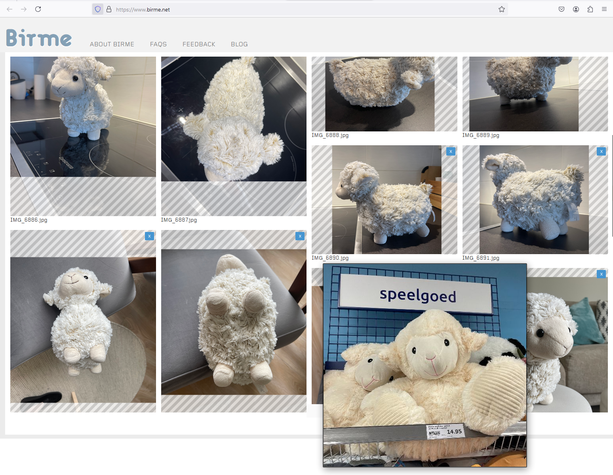
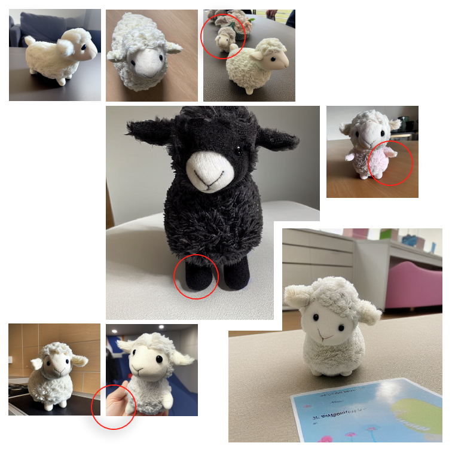

### Sheepfusion

Checkpoint model for Stable Diffusion 1.5 trained on a small set of fuzzy plush products with the [DreamBooth](https://huggingface.co/docs/diffusers/en/training/dreambooth) method. Fast training time (couple of minutes), altering the model itself, rewarding noisy input with classifier `sheepsnapshotmodel` to prompt on. Converting and prompting the build with [ONNX Runtime](https://onnxruntime.ai/docs/tutorials/csharp/stable-diffusion-csharp.html).

#### Input training images



#### Text-to-image on model

```csharp
using OnnxStack;

var pipeline = StableDiffusionPipeline.CreatePipeline(
    "model\\onnx",
    ModelType.Base,
    0,
    ExecutionProvider.Cpu,
    MemoryModeType.Maximum,
    null
);

var promptOptions = new PromptOptions { Prompt = "Photo of a cute sheepsnapshotmodel." };
var result = await pipeline.GenerateImageAsync(promptOptions);
await result.SaveAsync("output\\sheep001.png");
await pipeline.UnloadAsync();
```

#### Output generated images


